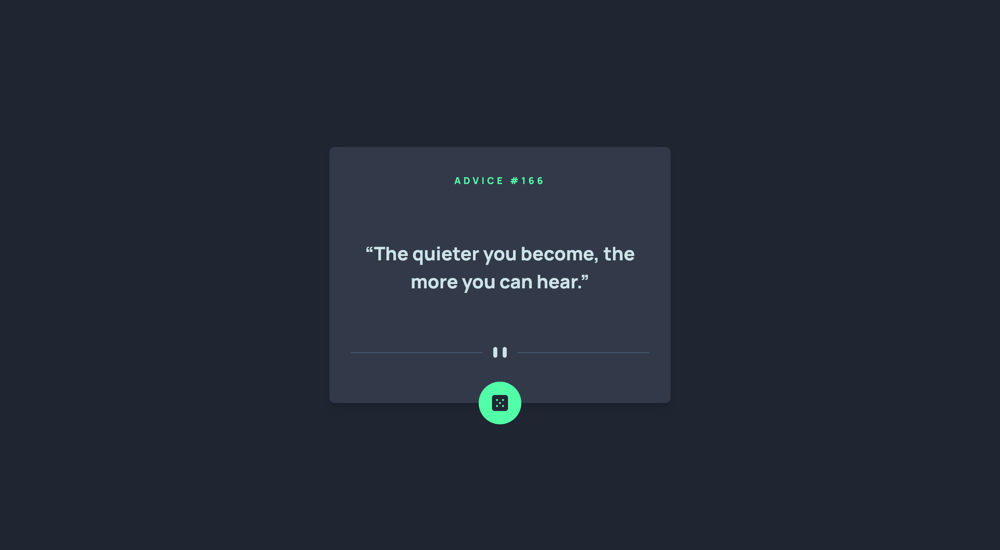

# Frontend Mentor - Advice generator app solution

This is a solution to the [Advice generator app challenge on Frontend Mentor](https://www.frontendmentor.io/challenges/advice-generator-app-QdUG-13db). Frontend Mentor challenges help you improve your coding skills by building realistic projects.

## Table of contents

- [Overview](#overview)
  - [The challenge](#the-challenge)
  - [Screenshot](#screenshot)
  - [Links](#links)
- [My process](#my-process)
  - [Built with](#built-with)
  - [What I learned](#what-i-learned)
  - [Continued development](#continued-development)
  - [Useful resources](#useful-resources)
- [Author](#author)

**Note: Delete this note and update the table of contents based on what sections you keep.**

## Overview

### The challenge

Users should be able to:

- See layout without any problems on any device.
- Get advice on first load.
- Receive new advice after click button with dice.
- See cooldown timer after get new advice.

### Screenshot



### Links

- Solution URL: [FEM](https://www.frontendmentor.io/solutions/advice-generator-app-with-reacttypescripttailwindcss-4NOXG5Mtb)
- Live Site URL: [Live with Vercel](https://advice-generator-gules.vercel.app/)

## My process

### Built with

- Mobile-first workflow
- [React](https://reactjs.org/) - JS library
- [TypeScript](https://www.typescriptlang.org/) - Programming language
- [TailwindCSS](https://tailwindcss.com/) - CSS framework

### What I learned

In this project I learned how to use TypeScript in components with some actions on buttons:

```typescript
interface IButton {
  cooldown: number
  handleClick: React.MouseEventHandler<HTMLButtonElement>
}
```

Also how to create timer with countdown:

```js
useEffect(() => {
  const timer = setInterval(() => {
    if (cooldown <= 0) return
    setCooldown((cooldown) => cooldown - 1)
  }, 1000)
  return () => {
    clearInterval(timer)
  }
}, [cooldown])
```

And here is my first type file:

```typescript
export interface IAdvice {
  id: number
  advice: string
}
```

After all there was one complicated thing about svg files.
Basically if you want to import them as ReactComponent, it is possible without any problems.
But in the case I use TypeScript in my project I need to create a file with my configuration for svg.

```custom.d.ts
  declare module '*.svg' {
    import React = require('react')
    export const ReactComponent: React.SFC<React.SVGProps<SVGSVGElement>>
    const src: string
    export default src
  }
```

And then add some line of code into tsconfig file ("typeRoots": ["./src/@types", "./node_modules/@types"],) and ("include": ["src", "src/custom.d.ts"])

### Continued development

In future project I would like more practicing with TypeScript, because I feel like TypeScript very important for business and if I want to get a job it would be preferred to know TypeScript.
Also I want to learn how to use TypeScript with Redux, and I know this topic more complicated.

### Useful resources

- [YouTube - TypeScript playlist (RU)](https://www.youtube.com/playlist?list=PLiZoB8JBsdzlG1oAY8U4vrBtVW07j6jil) - This playlist helped me to get into TypeScript easier. May be very useful for Russian-speaks developers.
- [YouTube - React/Typescript (RU)](https://www.youtube.com/watch?v=v8i-cv9NUV0) - This video shows good examples how to use TypeScript with React, very simple end encouraging really good. Again, better to watch if you know any Russian.

## Author

- GitHub - [@devildoctor27](https://github.com/DevilDoctor27)
- Frontend Mentor - [@devildoctor27](https://www.frontendmentor.io/profile/DevilDoctor27)
- Twitter - [@devildoctor27](https://twitter.com/DevilDoctor27)
